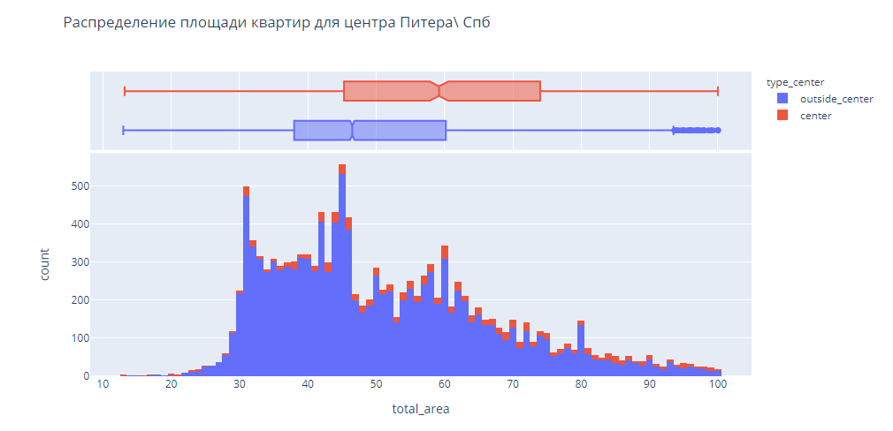
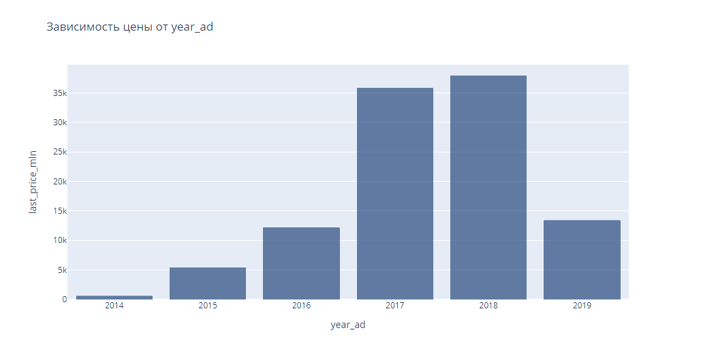

# Исследование объявлений о продаже квартир

В проекте использованы данные сервиса Яндекс.Недвижимость . Это архив объявлений о продаже квартир в Санкт-Петербурге и соседних населённых пунктов за 4 года.  Задача определять рыночную стоимость объектов недвижимости. Для решения задачи  установим параметры которые позволят построить автоматизированную систему. Модель отследит аномалии и предупредит о мошенниках. 

По каждой квартире на продажу доступны два вида данных. Первые вписаны пользователем, вторые — получены автоматически на основе картографических данных. Например, расстояние до центра, аэропорта, ближайшего парка и водоёма. 

В проекте тчательно изучены данные. 
Выполнено много предоработок по заполнению пропущенных значений.
Иследованы и графически показаны основные величины влияющие на цену квартиры.

Сделаны выводы:
Для определения рыночной цены квартир можно использовать следующие параметры:

цена сильно зависит от площади квартиры.
кол-ва комнат
немного падает при удалении от центра (в радиусе 8км)
первый этаж стоит дешевле последнего, последний немного дешевле промежуточных этажей
влияние этих факторов усиливается в центре города
в центре цена квадратного метра, а также площадь квартиры выше
квартира в среднем продается полгода, половина продает квартиру за 3 месяца.
Рекомендую:
ввести проверку ввода высоты потолка (коридор значений от 2м и до 6м)
контролировать слишком быстрые продажи до 1-2 недель, не учитывать цену таких обьявлений для определения средних значений..

tags: pandas, numpy, matplotlib, plotly
